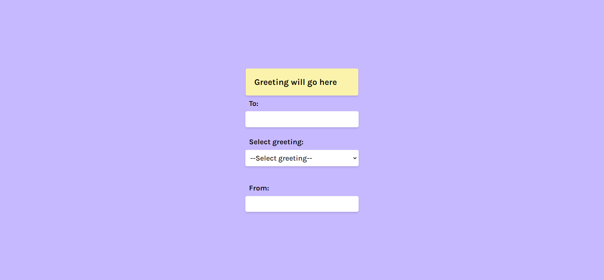
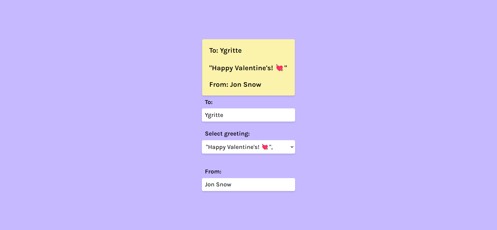
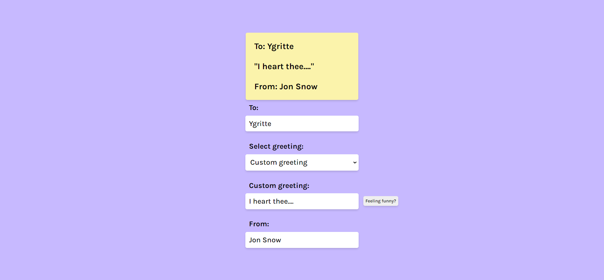
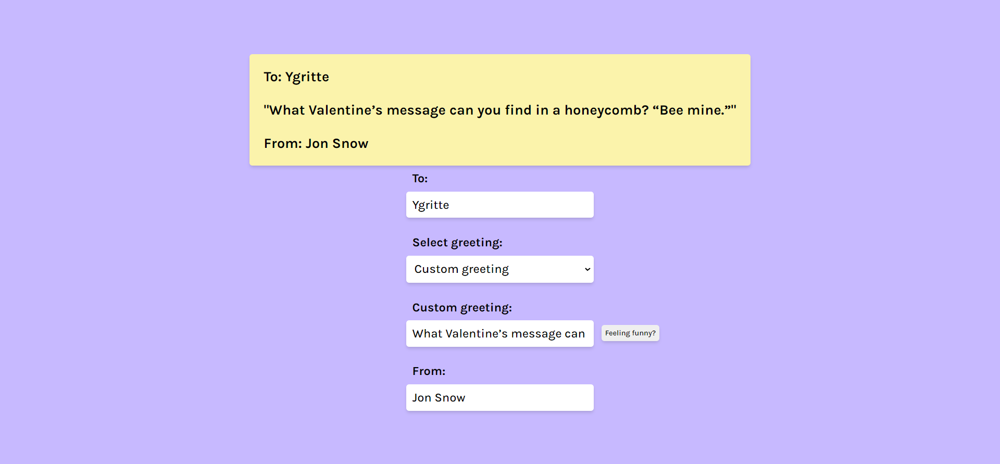

# Frontend Mentor - Profile card component solution

This is a solution to the [Valentine's Challenge](https://scrimba.com/learn/codeweeks/-gift-selector-challenge-cof354519882e285411fb8562). 

## Table of contents

- [Overview](#overview)
  - [Screenshot](#screenshot)
  - [Links](#links)
- [My process](#my-process)
  - [Built with](#built-with)
  - [What I learned](#what-i-learned)
  - [Continued development](#continued-development)
  - [Useful resources](#useful-resources)
- [Author](#author)
- [Acknowledgments](#acknowledgments)

## Overview

This is my solution to the Valentine's Challenge for the 14th of January, 2022.
It is a small project that interacts with the users to calculate the cost of a
gift based on two factors, the food choice (e.g. chocolate) and transportation
(e.g. limo) and a choice of adding balloons or not.

### Screenshot






### Links

- Solution URL: [GitHub](https://github.com/newbpydev/valentines-14-2022)
- Live Site URL: [Live Site](https://keen-lumiere-68538c.netlify.app/)

## My process

### Built with

- Semantic HTML5 markup
- CSS custom properties
- Flexbox
- Javasript

### What I learned

I have learned on this project how to customize the checkbox and how to add
elements on a page using js only, I didn't implement it because there was an
error while using document.body.form.inserBefore().

```css
input[type="checkbox"] {
    appearance: none;
    cursor: pointer;
    height: 2rem;
    width: 2rem;
    background-color: #fff;
    border-radius: .5rem;
    display: flex;
    justify-content: center;
    align-items: center;
    transition: all .2s ease;
}

input[type="checkbox"]::after {
    content: '🎈';
    display: none;
}

input[type="checkbox"]:hover {
    background-color: #ddd;
}

input[type="checkbox"]:checked {
    border: .1rem solid #F04C86;
}

input[type="checkbox"]:checked:after {
    display: block;
}
```

### Continued development

For future development, I will continue to use expore the js Dom to manipulate
the elements on my pages.

### Useful resources

- [MDN - Node.insertBefore()](https://developer.mozilla.org/en-US/docs/Web/API/Node/insertBefore) - The insertBefore() method of the Node interface inserts a node before a reference node as a child of a specified parent node.
- [YouTube - Custom Checkbox Pure CSS Tutorial](https://www.youtube.com/watch?v=NfW_5Y1RZQ4&t=2s&ab_channel=FollowAndrew) - Learn how to create these fancy custom checkbox form elements with pure CSS!  There's a couple of tricks with the HTML source order by making the label follow the input field, and then styling some of the CSS pseudo elements, so that our checkboxes can have custom CSS as well as a custom image used for the actual checkmark.  We also add a bit of animation to make our checkboxes animate by using the transition properties.

## Author

- Website - [Juan Gomez](https://www.newbpydev.com)
- Frontend Mentor - [@newbpydev](https://www.frontendmentor.io/profile/newbpydev)
- Twitter - [@Newb_PyDev](https://twitter.com/Newb_PyDev)

## Acknowledgments

The code may not be perfect compared to my sensei @jonasschmedtman but I need
to thank him because he has shown me the ropes and now I am a confident web
designer.


